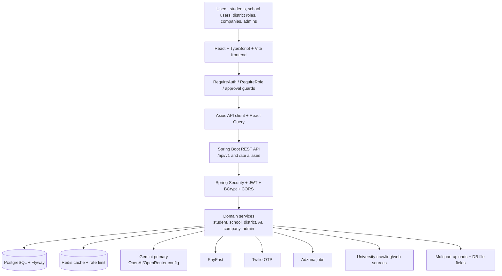

# EDURITE PRODUCT ARCHITECTURE FOR LOVABLE

Source inspected: existing EduRite repository at `edurite-ai-career-guidance-clean`.

Important constraint for Lovable: redesign the frontend UI/UX only. Preserve the backend, routes, auth model, role access, and existing API integrations. Do not invent production features. Anything marked incomplete, placeholder, hardcoded, or "Requires backend endpoint" must remain clearly identified until backend support exists.

## 1. EduRite Overview

EduRite is an education and career guidance platform for South African learners, schools, teachers, district officials, administrators, and companies that publish bursaries or search for student talent.

The problem it solves:

- Learners need career guidance, APS/qualification checking, university/programme discovery, bursary discovery, learning support, applications tracking, CV support, and AI tutoring.
- Schools need a portal for learners, teachers, classes, subjects, curriculum coverage, academic insights, interventions, reports, announcements, and support requests.
- Teachers need learner lists, assignments/SBA, notes/resources, assessment marking, curriculum resources, progress tracking, reports, and settings.
- District roles need school oversight, analytics, curriculum repositories, ATP/syllabus/lesson-plan management, compliance tracking, school registration approvals, interventions, visits, and support workflows.
- Companies need account approval, bursary posting, student search, shortlisting, invitations, and document verification.
- Platform admins need user management, roles, company approvals, bursary moderation, district/school management, notifications, analytics, audit logs, and system settings.

Major product areas:

- Public discovery: careers, courses, institutions, bursaries, pricing, policy pages.
- Authentication and onboarding: role-aware login, student/company/school registration, OTP verification, forgot/reset password, Google login for student/company, first-login password change.
- Student platform: dashboard, profile, academic profile, documents, AI career guidance, bursary guidance, psychometric assessment, career roadmaps, APS calculator, opportunities/jobs, bursary finder, universities, university applications, scholarship assistant, CV builder, AI tutor, learning centre, rewards, notifications, subscription, settings, school linking.
- School portal: school admin workspace, teacher workspace, learner portal, curriculum resources, ATP/calendar, classes, subjects, assessments, submissions, results, reports, announcements, support.
- District portal: district dashboard, schools, registration requests, analytics, AI insights, interventions, reports, curriculum management, circuit manager workflows, subject advisor workflows.
- Company portal: profile, verification documents, bursary management, student talent search, bookmarks, shortlists, messages, invitations, notifications/settings.
- Admin portal: platform operations and governance.

How it fits together:

- The React frontend uses protected routes and role-aware layouts.
- The backend is a Spring Boot modular monolith exposing REST APIs under both `/api/v1/...` and `/api/...` aliases.
- PostgreSQL stores users, roles, student profiles, schools, districts, companies, bursaries, applications, curriculum resources, tutor sessions, notifications, subscriptions, and related records.
- Redis is configured for Spring cache and rate limiting.
- JWT protects private APIs. Role-based access is enforced in Spring Security and frontend route guards.
- AI features are routed through backend services using Gemini as the configured primary provider, with OpenAI/OpenRouter fallback configuration present.
- External integrations include Google OAuth, Twilio OTP, PayFast payments, Adzuna jobs, WhatsApp webhook handling, Google Books/Open Library/Open Trivia/YouTube-style learning integrations as service-backed resource queries, and university website crawling/analysis.

## 2. Technology Architecture

Actual technologies found:

- Frontend framework: React 18 with Vite.
- Frontend language: TypeScript.
- Routing: `react-router-dom` v6.
- Server state: TanStack React Query v5.
- Forms/validation: `react-hook-form`, Zod, `@hookform/resolvers`.
- Styling: Tailwind CSS plus global CSS variables in `frontend/src/styles/index.css`.
- Icons/animation: `lucide-react`, `framer-motion`.
- HTTP client: Axios wrapper in `frontend/src/services/apiClient.ts`.
- Backend framework: Spring Boot 3.5.13.
- Backend language/runtime: Java 21.
- Persistence: Spring Data JPA/Hibernate.
- Database: PostgreSQL.
- Migrations: Flyway under `backend/src/main/resources/db/migration`.
- Cache/rate limiting: Redis, Spring Cache, custom `RedisRateLimitFilter`.
- Authentication/security: Spring Security, BCrypt, JWT, stateless sessions, CORS config, role authorities.
- API docs: Springdoc OpenAPI/Swagger.
- AI integrations: Gemini, OpenAI, OpenRouter configuration; Gemini service is the main implementation.
- File storage: files are mostly stored as URLs or database binary/base64 fields. Curriculum assets support PDF/DOCX/Excel bytes/base64. Student CV/transcript uploads use multipart and store file URL fields. Company verification documents use multipart.
- Payments/subscriptions: PayFast plus generic payment callback/webhook endpoints.
- External services: Google OAuth/token verification, Twilio OTP, Adzuna jobs, WhatsApp webhook, university crawling, learning resource sources.
- Deployment: Dockerfiles for frontend/backend, Nginx config for frontend, Docker Compose, Kubernetes manifests for backend deployment/service/HPA/PDB/config/secret examples.

## 3. User Roles

Confirmed frontend/backend roles:

| Role | Purpose | Main dashboard | Important pages | Permissions/actions | First screen priorities |
|---|---|---|---|---|---|
| STUDENT | Independent learner/career user | `/student/dashboard` | Profile, psychometric, AI guidance, AI tutor, CV builder, rewards, roadmaps, opportunities, bursary finder, scholarships, universities, university applications, subscription, notifications, settings, my school | Manage own profile/data, upload CV/transcript, save careers/bursaries/opportunities, calculate APS, generate/save roadmaps, manage applications, use tutor, join school | Profile completeness, recommended careers/bursaries, APS/readiness, pending tasks, plan/subscription, school link |
| SCHOOL_STUDENT | Learner inside a school portal | `/school-student/dashboard` | Dashboard only route, with internal sections for subjects, assignments/SBA, notes, exams/quizzes, submissions, marks/feedback, progress | View school-assigned work, submit tasks, view marks/progress/resources | Due tasks, recent marks, subjects, progress |
| TEACHER | School teacher | `/teacher/dashboard` | Learners, academic insights, career readiness, courses, bursaries, curriculum, calendar, interventions, reports, settings | View assigned learners/classes/subjects, create tasks/notes, mark submissions, view curriculum/resources, report/export, create interventions | Classes, tasks due, submissions to mark, learner risks, ATP/curriculum reminders |
| SCHOOL_ADMIN | School administrator | `/school/dashboard` or pending approval screens | Learners, enrolment, join requests, teachers, classes, subjects, curriculum, assignments, assessments, results, insights, interventions, reports, announcements, support, settings | Manage school profile, users, learners, teachers, classes, subjects, teacher assignments, enrolments, imports, interventions, announcements, reports | Pending learner joins, school snapshot, teacher/class setup, academic risks, curriculum coverage |
| DISTRICT_ADMIN | District admin operations | `/district/dashboard` | Schools, school registration requests, analytics, AI insights, interventions, reports, settings, curriculum views | District dashboard, school oversight, approve/reject registrations, announcements, interventions, reports | District KPIs, pending registrations, at-risk schools, compliance |
| DISTRICT_DIRECTOR | District leadership | `/district/dashboard` | Schools, analytics, reports, curriculum | District-wide monitoring and reporting | District performance, curriculum compliance, school risks |
| CIRCUIT_MANAGER | Circuit oversight | `/district/circuit/dashboard` | My schools, registration requests, curriculum monitoring, visits, support requests, interventions, reports | Circuit school monitoring, visits, support workflow updates, interventions | Assigned schools, visits, support requests, curriculum exceptions |
| SUBJECT_ADVISOR | Subject/curriculum advisor | `/district/advisor/dashboard` | Teachers, ATP monitoring, assessments, curriculum resources, interventions, reports | Teacher/subject monitoring, common assessment creation, ATP oversight, AI support plans | Teacher support needs, subject gaps, ATP compliance, assessments |
| COMPANY | Bursary provider/talent partner | `/company/dashboard` or pending approval | Profile, verification docs, bursaries, applicants/student search, shortlisted, notifications, settings | Update profile, upload verification documents, create/update/close/reopen bursaries, search/bookmark/shortlist/message/invite students | Approval status, document readiness, bursary/application metrics |
| ADMIN | Platform admin | `/admin/dashboard` | Users, district management, roles, pending company approvals, bursaries, subscriptions, payments, notification templates, analytics, notifications, audit logs, schools, settings | Full platform operations: user lifecycle, role management, company review, bursary moderation, district/school setup, notifications, audit/settings | Platform metrics, pending approvals, user/admin actions, system settings |

## 4. Complete Navigation Architecture

Public navigation:

- `/auth/login` is the default landing target from `/`.
- Public pages: About, Careers, Career Details, Courses, Course Details, Institutions, Institution Details, Bursaries, Bursary Details, Pricing, Privacy Policy, Terms and Conditions.
- Login aliases: `/auth/login`, `/school/login`, `/teacher/login`, `/school-student/login`, `/company/login`, `/admin/login`, `/district/login`.
- Registration aliases: student, company, school.
- OTP, forgot password, reset password.

Student navigation:

- Top module tabs: Dashboard, Points & Rewards, Career Roadmaps, Opportunities, Bursary Finder, Scholarship Assistant, Universities, University Applications.
- Sidebar Personal: My Profile, Psychometric Test, AI Guidance, AI Tutor, Learning Centre, CV Builder.
- Sidebar Account/More: Subscription, Notifications, Settings, Change Password.
- Header: search dashboard, My School button, notifications, messages/AI tutor shortcut, user avatar/plan.

Company navigation:

- Dashboard
- Company Profile
- Post Bursary
- Manage Bursaries
- Applications
- Documents
- Notifications
- Settings
- Change Password
- Pending companies see a reduced nav: Review Status, Company Profile, Documents, Settings, Change Password.

Admin navigation:

- Dashboard
- User Management
- District Management
- Company Approvals
- Bursary Management
- Notifications
- Analytics
- School Management
- System Settings
- Change Password

District Admin/Director navigation:

- Overview: District Dashboard, Analytics, AI Insights.
- Schools: Schools, School Registration Requests, School Performance, School Reports, School Compliance.
- Academics: Curriculum Management, ATP Repository, Syllabus Repository, Lesson Plan Repository, Curriculum Calendar, Weekly Coverage Tracker, Teacher Reminders, Curriculum Compliance, Learner Readiness, APS Readiness, Subject Gaps, Career Pathways.
- Administration: Interventions, Announcements, Support Requests, District Reports.
- Settings: District Settings, Security/Change Password.

Circuit Manager navigation:

- Dashboard
- My Schools
- School Registration Requests
- Curriculum Monitoring
- School Visits
- Support Requests
- Interventions
- Reports
- Security/Change Password

Subject Advisor navigation:

- Dashboard
- Teachers
- Curriculum Resources
- ATP Monitoring
- Assessments
- Interventions
- Reports
- Security/Change Password

School Admin route/navigation architecture:

- Dashboard
- Analytics
- AI Insights
- Learners
- Enrolment
- My School Requests
- Teachers
- Classes
- Subjects
- Curriculum
- Curriculum Calendar
- Assignments
- Assessments
- Results
- Academic Insights
- Career Readiness
- Courses
- Bursaries
- Interventions
- Reports
- Announcements
- Notifications
- Support Requests
- School Settings
- Settings
- Change Password via shared account route

Teacher navigation:

- Dashboard
- Learners
- Academic Insights
- Career Readiness
- Courses
- Bursaries
- Curriculum
- Curriculum Calendar
- Interventions
- Reports
- Settings
- Change Password

School Student navigation:

- Route: `/school-student/dashboard`
- Internal dashboard sections: My Subjects, Assignments & SBA, Notes & Resources, Exams & Quizzes, My Submissions, Marks & Feedback, Progress.

## 5. Frontend Route Map

| URL | Component/page | Role access | Purpose | Important actions |
|---|---|---|---|---|
| `/` | Navigate | Public | Redirects to login | Redirect |
| `/about` | AboutPage | Public | Product/about page | Browse |
| `/careers` | CareersPage | Public/authenticated GET | Career catalogue | Search/filter, open details |
| `/careers/:id` | CareerDetailsPage | Public route, authenticated API GET | Career detail | View career |
| `/courses` | CoursesPage | Public/authenticated GET | Course catalogue | Search/filter |
| `/courses/:id` | CourseDetailsPage | Public route, authenticated API GET | Course detail | View course |
| `/institutions` | InstitutionsPage | Public | Institutions list | Search/filter |
| `/institutions/:id` | InstitutionDetailsPage | Public | Institution detail | View details |
| `/bursaries` | BursariesPage | Public/authenticated GET | Bursary catalogue | Search/filter |
| `/bursaries/:id` | BursaryDetailsPage | Public route, authenticated API GET | Bursary detail | View bursary |
| `/pricing` | PricingPage | Public | Pricing plans | View plans |
| `/privacy-policy` | PrivacyPolicyPage | Public | POPIA/privacy policy | Read |
| `/terms-and-conditions` | TermsAndConditionsPage | Public | Terms | Read |
| `/auth/login`, `/school/login`, `/teacher/login`, `/school-student/login`, `/company/login`, `/admin/login`, `/district/login` | LoginPage | Public | Shared login | Login, Google login for student/company |
| `/auth/register`, `/auth/register/student` | RegisterStudentPage | Public | Student registration | Submit registration + POPIA consent |
| `/auth/register/company`, `/register/company`, `/company/register` | RegisterCompanyPage | Public | Company registration | Submit for approval |
| `/auth/register/school`, `/school/register` | RegisterSchoolPage | Public | School self-registration | Select province/district/circuit/school, submit approval request |
| `/auth/verify-otp`, `/verify-email` | VerifyEmailPage | Public | OTP verification | Verify/resend OTP |
| `/auth/verify-otp/notice`, `/verify-email/notice` | VerifyEmailNoticePage | Public | Verification notice | Navigate to verify |
| `/auth/forgot-password`, `/company/forgot-password`, `/admin/forgot-password`, `/district/forgot-password` | ForgotPasswordPage | Public | Password recovery | Request OTP |
| `/auth/reset-password`, `/company/reset-password`, `/admin/reset-password`, `/district/reset-password` | ResetPasswordPage | Public | Reset password | Submit OTP/new password |
| `/payments/payfast/return`, `/payments/payfast/cancel` | PayFastRedirectRelay | Public callback | PayFast redirect relay | Redirect to student subscription |
| `/account/change-password` | AccountChangePasswordPage | Authenticated | Password change/forced first login | Request OTP, confirm change |
| `/student/dashboard` | StudentDashboardPage | STUDENT | Student dashboard | View metrics, progress, guidance |
| `/student/profile` | StudentProfilePage | STUDENT | Profile management | Edit profile, upload CV/transcript, save/apply profile versions |
| `/student/academic-profile`, `/student/documents`, `/student/qualifications`, `/student/experience` | StudentProfilePage aliases | STUDENT | Profile subsections reuse same page | Same as profile |
| `/student/recommendations/careers` | StudentCareerRecommendationsPage | STUDENT | AI career guidance | Generate/refresh AI guidance |
| `/student/recommendations/bursaries` | StudentBursaryRecommendationsPage | STUDENT | AI bursary guidance | Generate bursary recommendations |
| `/student/psychometric` | StudentPsychometricPage | STUDENT | Psychometric assessment | Select assessment, answer questions, submit, view latest/history |
| `/student/cv-builder` | StudentCvBuilderPage | STUDENT | CV builder | Edit CV, save, view AI suggestions |
| `/student/ai-tutor` | StudentAiTutorPage | STUDENT | AI tutor chat | Ask question, view sessions/messages |
| `/student/learning-centre` | StudentLearningCentrePage | STUDENT | Learning resources | Browse catalogue/recommended/external resources, refresh courses for admin |
| `/student/rewards` | StudentRewardsPage | STUDENT | Gamification | View points/rules/claims, claim reward |
| `/student/careers/:id` | StudentCareerDetailsPage | STUDENT | Auth career detail | View/save career/opportunity |
| `/student/career-roadmaps` | StudentCareerRoadmapsPage | STUDENT | Roadmap explorer/APS | Calculate APS, generate/save roadmap |
| `/student/saved` | StudentSavedPage | STUDENT | Opportunities/jobs | Search unified opportunities, jobs, save/unsave |
| `/student/applications` | StudentApplicationsPage | STUDENT | Bursary finder/applications | Search bursaries, save bursaries, view applications |
| `/student/scholarships` | StudentScholarshipAssistantPage | STUDENT | Scholarship applications | Create/update/delete application, generate motivation letter |
| `/student/universities` | StudentUniversitiesPage | STUDENT | University directory | Search/open programme/admissions pages |
| `/student/universities/:slug/programmes` | StudentUniversityProgrammesPage | STUDENT | University programmes | Search programmes |
| `/student/universities/:slug/admission-requirements` | StudentUniversityAdmissionRequirementsPage | STUDENT | Admissions requirements | View requirements |
| `/student/colleges-tvets` | StudentCollegesTvetsPage | STUDENT | TVET/private colleges | Search/filter static/local list |
| `/student/university-applications` | StudentUniversityApplicationsPage | STUDENT | University application tracker | Create/update/delete applications |
| `/student/notifications` | StudentNotificationsPage | STUDENT | Notifications inbox | Mark read/all read, delete |
| `/student/subscription` | StudentSubscriptionPage | STUDENT | Plan/payment management | Checkout, PayFast, confirm/cancel |
| `/student/settings` | StudentSettingsPage | STUDENT | Student settings/account deletion | Update notification settings, delete own account |
| `/student/my-school` | StudentMySchoolPage | STUDENT | Link to school | Search schools, request join |
| `/company/*` routes | CompanyPages | COMPANY | Company portal | Profile, docs, bursaries, student search, shortlists |
| `/admin/*` routes | AdminPages | ADMIN | Admin portal | Users, roles, approvals, bursaries, settings, notifications, district/school ops |
| `/district/*` routes | DistrictPages | DISTRICT_ADMIN/DIRECTOR/CIRCUIT_MANAGER/SUBJECT_ADVISOR | District/circuit/advisor portal | Schools, curriculum, reports, interventions |
| `/school/*` routes | SchoolAdminPortalPage | SCHOOL_ADMIN | School admin command center | Learners, teachers, curriculum, reports, settings |
| `/teacher/*` routes | TeacherPortalPage | TEACHER | Teacher portal | Learners, curriculum, marking, reports |
| `/school-student/dashboard` | SchoolStudentDashboardPage | SCHOOL_STUDENT or STUDENT with school portal access | Learner school portal | View tasks/resources, submit work |

## 6. Backend API Map

All listed endpoints are available with `/api/v1` and `/api` prefixes where controller mapping declares both.

| Module | Endpoint | Method | Controller | Purpose | Frontend module | Auth/role |
|---|---|---|---|---|---|---|
| Auth | `/auth/me` | GET | AuthController | Current authenticated user | Auth restore | Public path but returns 401 if no principal |
| Auth | `/auth/register`, `/auth/register/student`, `/auth/register/company`, `/auth/register/school` | POST | AuthController | Account creation | Registration pages | Public |
| Auth | `/auth/login`, `/auth/google`, `/auth/refresh`, `/auth/logout`, `/auth/keep-alive` | POST | AuthController | Session lifecycle | Login/auth provider | Login public; keep-alive requires principal |
| Auth | `/auth/verify-otp`, `/auth/resend-verification-otp` | POST | AuthController | OTP verification | Verify page | Public |
| Auth | `/auth/forgot-password/request-otp`, `/auth/forgot-password/reset` | POST | AuthController | Password reset | Forgot/reset pages | Public |
| Auth | `/auth/school/forgot-password`, `/auth/school/resend-otp`, `/auth/school/verify-otp`, `/auth/school/reset-password` | POST | AuthController | School password recovery | School login/reset | Public |
| Account | `/account/me` | GET/DELETE | AccountController | Account info/delete own account | Settings | Authenticated |
| Account | `/account/password/change/request-otp`, `/account/password/change/confirm`, `/account/password/change/first-login` | POST | AccountController | Password change | Change password | Authenticated |
| Student | `/student/profile` | GET/PUT | StudentController | Student profile | Profile | STUDENT |
| Student | `/student/profile/saved` and `/{savedProfileId}` | GET/POST/DELETE | StudentController | Saved profile versions | Profile | STUDENT |
| Student | `/student/profile/saved/{id}/apply` | POST | StudentController | Apply saved profile | Profile | STUDENT |
| Student | `/student/profile/cv`, `/student/profile/transcript` | POST multipart | StudentController | Upload CV/transcript | Profile/Documents | STUDENT |
| Student | `/student/dashboard` | GET | StudentController | Dashboard data | Student dashboard | STUDENT |
| Student | `/student/settings`, `/student/preferences` | GET/PUT | StudentController | Settings/preferences | Settings/profile | STUDENT |
| Student | `/student/careers/{id}/save`, `/student/bursaries/{id}/save` | POST/DELETE | StudentController | Save/unsave | Saved/opportunities | STUDENT |
| Opportunities | `/student/opportunities`, `/student/opportunities/{type}/{id}/save` | GET/POST/DELETE | StudentOpportunityController | Unified opportunities | Opportunities | STUDENT |
| AI | `/ai/career-advice`, `/ai/career-advice/me`, `/ai/bursary-guidance/me`, `/ai/dashboard-summary` | POST/GET | AiController | AI guidance | Student guidance/dashboard | Authenticated; student data expected |
| AI | `/ai/analyse-university-sources`, `/ai/default-university-sources`, `/ai/source-coverage`, `/ai/gemini-health`, `/ai/test` | POST/GET | AiController | University source AI analysis and diagnostics | AI guidance/university admin refresh | Auth; test public |
| Psychometric | `/student/psychometric/assessments`, `/assessments/{id}/questions`, `/assessments/{id}/attempts`, `/submit`, `/latest` | GET/POST | PsychometricController | Assessments and results | Psychometric | STUDENT |
| Psychometric | `/public/psychometric/submit` | POST | PsychometricController | Public psychometric submit | Public discovery | Public |
| Career/catalogue | `/careers`, `/careers/{id}` | GET | CareerController | Career catalogue | Public/student careers | Authenticated GET by security config |
| Course/catalogue | `/courses`, `/courses/{id}` | GET | CourseController | Course catalogue | Public/student courses | Authenticated GET by security config |
| Institutions | `/institutions`, `/institutions/{id}` | GET | InstitutionController | Institution catalogue | Public institutions | Public permit |
| Universities | `/student/universities/{slug}/programmes`, `/admission-requirements` | GET | StudentUniversityInfoController | Programme/admission views | Student universities | STUDENT |
| Universities admin | `/admin/universities/{slug}/refresh` | POST | AdminUniversityInfoController | Refresh crawled university info | Admin-only refresh in student university pages | ADMIN |
| Bursaries | `/bursaries`, `/bursaries/search`, `/bursaries/{id}`, `/bursaries/recommendations/me` | GET | BursaryController | Bursary list/search/detail/recommendations | Bursary finder | Authenticated/student for recommendations |
| Applications | `/bursaries/{id}/applications`, `/applications/me` | POST/GET | ApplicationController | Apply to bursary/list own | Student applications | STUDENT |
| Scholarships | `/student/scholarship-applications`, `/upcoming`, `/{id}`, `/{id}/motivation-letter` | GET/POST/PUT/DELETE/POST | ScholarshipApplicationController | Scholarship tracker and AI letter | Scholarship assistant | STUDENT |
| University applications | `/student/university-applications`, `/{id}` | GET/POST/PUT/DELETE | UniversityApplicationController | University application tracker | University applications | STUDENT |
| CV | `/student/cv`, `/student/cv/ai-suggestions` | GET/PUT/GET | StudentCvController | CV builder | CV builder | STUDENT |
| Tutor | `/student/tutor/sessions`, `/sessions/{id}`, `/ask` | GET/POST | TutorController | AI tutor sessions/questions | AI Tutor | STUDENT |
| Learning centre | `/student/learning-centre/catalogue`, `/recommended`, `/courses`, `/courses/refresh`; `/learning-centre/books`, `/google-books`, `/quizzes`, `/videos` | GET/POST | LearningCentreController | Learning resources | Learning centre | STUDENT for student endpoints; external learning endpoints used by student page |
| Gamification | `/student/gamification/summary`, `/tasks/complete`, `/claims` | GET/POST | GamificationController | Points/rewards | Rewards | STUDENT |
| Notifications | `/notifications`, `/unread-count`, `/{id}/read`, `/read-all`, `/{id}`, `/stream` | GET/PATCH/DELETE | NotificationController | User notifications and SSE stream | Notifications/header | All authenticated roles |
| Admin notifications | `/admin/notifications/send`, `/admin/notifications`, `/users/filter`, `/{id}` | POST/GET/DELETE | AdminNotificationController | Broadcast/filtered notifications | Admin notifications | ADMIN |
| Company | `/companies/me`, `/companies/me/documents`, `/companies/dashboard` | GET/PUT/POST | CompanyController | Company profile/docs/dashboard | Company portal | COMPANY |
| Company bursaries | `/companies/bursaries`, `/companies/bursaries/{id}`, `/unpublish`, `/close`, `/reopen` | GET/POST/PUT/PATCH | CompanyController | Manage own bursaries | Company bursaries | COMPANY |
| Company talent | `/companies/students/search`, `/students/{id}/bookmarks`, `/students/bookmarks`, `/students/{id}/shortlists`, `/students/shortlists`, `/students/{id}/messages`, `/messages`, `/students/{id}/invitations`, `/invitations` | GET/POST | CompanyController | Talent search/outreach | Company students/shortlisted/notifications | COMPANY |
| Admin | `/admin/users`, `/users/{id}/status`, `/suspend`, `/unsuspend`, `/users/{id}` | GET/PATCH/DELETE | AdminController | User management | Admin users | ADMIN |
| Admin | `/admin/roles`, `/roles/{id}` | GET/POST/PUT/DELETE | AdminController | Role templates | Admin roles | ADMIN |
| Admin | `/admin/bursaries`, `/pending`, `/{id}/review`, `/suspend`, `/reactivate`, `/{id}` | GET/PATCH/DELETE | AdminController | Bursary moderation | Admin bursaries | ADMIN |
| Admin | `/admin/settings`, `/audit-logs`, `/analytics` | GET/PUT | AdminController | Settings/audit/analytics | Admin dashboard/settings | ADMIN |
| Admin district/school | `/admin/districts`, `/districts/{id}`, `/districts/{id}/create-admin`, `/districts/{id}/reset-password`, `/school-management`, `/school-directory`, `/schools/whitelist`, `/schools/{id}/reset-password` | GET/POST/PUT | AdminController | District and school provisioning | Admin district/school pages | ADMIN |
| District | `/district/dashboard`, `/me`, `/me/statistics`, `/schools`, `/me/schools`, `/schools/{id}`, `/schools/{id}/analytics` | GET | DistrictPortalController | District overview/school detail | District pages | DISTRICT_ADMIN/DIRECTOR |
| District registrations | `/district/school-registration-requests`, `/{id}/approve`, `/{id}/reject`, `/{id}/decision` | GET/POST | DistrictPortalController | School registration approvals | Registration requests | DISTRICT_ADMIN/DIRECTOR/CIRCUIT_MANAGER/ADMIN context |
| District ops | `/district/analytics`, `/ai-insights`, `/reports`, `/reports/export`, `/announcements`, `/interventions`, `/settings` | GET/POST | DistrictPortalController | Analytics/reporting/interventions | District pages | DISTRICT_ADMIN/DIRECTOR |
| District education | `/district/education/director/dashboard`, `/circuit/dashboard`, `/circuit/schools`, `/circuit/curriculum`, `/circuit/visits`, `/circuit/support-requests`, `/circuit/interventions`, `/education/interventions`, `/education/interventions/{id}/ai-support-plan`, `/advisor/dashboard`, `/advisor/teachers`, `/advisor/atp-monitoring`, `/advisor/assessments` | GET/POST/PUT | DistrictEducationController | Director/circuit/advisor workflows | District role pages | District education roles |
| Location | `/locations/provinces`, `/locations/districts`, `/locations/provinces/{id}/districts`, `/locations/districts/{id}/circuits` | GET | LocationController | Registration location selectors | School registration/admin | Public/used in auth |
| Curriculum district | `/district/curriculum/assets`, `/assets/{id}`, `/archive`, `/download`, `/extract`, `/calendar`, `/calendar/items`, `/publish`, `/archive`, `/calendar/sync`, `/compliance` | GET/POST/PUT/DELETE | DistrictCurriculumController | ATP/syllabus/lesson-plan repository/calendar/compliance | District curriculum | DISTRICT roles |
| Curriculum school/teacher | `/school/curriculum/assets`, `/school/curriculum/calendar`, `/school/curriculum/resources`, `/teacher/curriculum/resources`, `/teacher/curriculum/calendar`, `/teacher/curriculum/calendar/{id}/lesson-plan`, `/teacher/portal/curriculum/widgets`, `/reminders`, `/weeks/{id}`, `/lesson-plan/generate`, `/curriculum/resources/{id}/download|view` | GET/POST/PATCH | Curriculum controllers | Curriculum resources and lesson plans | School/teacher curriculum | SCHOOL_ADMIN/TEACHER |
| School admin basic | `/school/dashboard`, `/profile`, `/classes`, `/subjects`, `/subjects/catalogue`, `/subjects/summary`, `/atp-topics`, `/teacher-assignments`, `/learner-enrollments`, `/teachers`, `/learners`, `/users`, `/learners/bulk-upload`, `/tasks`, `/assessments`, `/submissions`, `/results`, `/notes`, `/progress` | GET/POST/PUT/PATCH/DELETE | SchoolAdminPortalController | School data management | School admin workspace | SCHOOL_ADMIN |
| School admin portal | `/school/portal/dashboard`, `/learners`, `/learners/{id}`, `/academic-insights`, `/career-readiness`, `/bursary-readiness`, `/interventions`, `/reports/export`, `/settings` | GET/POST/PATCH | SchoolAdminPortalController | Command center intelligence | School admin command center | SCHOOL_ADMIN |
| School admin command | `/school-admin/...` | GET/POST/PATCH/DELETE | SchoolAdminCommandController / MySchoolRequestController | Extended school command endpoints and learner join request approvals | SchoolAdminCommandCenterPage | SCHOOL_ADMIN |
| Teacher | `/teacher/dashboard`, `/notes`, `/tasks`, `/atp-topics`, `/tasks/{id}/submissions`, `/submissions/{id}/mark`, `/progress`, `/classes`, `/subjects`, `/assignments`, `/assessments`, `/submissions`, `/analytics`, `/calendar`, `/activity`, `/search` | GET/POST | TeacherPortalController | Teacher operations | Teacher workspace | TEACHER |
| Teacher portal | `/teacher/portal/dashboard`, `/learners`, `/learners/{id}`, `/academic-insights`, `/career-readiness`, `/bursary-readiness`, `/interventions`, `/reports/export`, `/settings` | GET/POST | TeacherPortalController | Teacher insight portal | Teacher portal | TEACHER |
| School student | `/school-student/dashboard`, `/notes`, `/subjects`, `/tasks`, `/assessments`, `/submissions`, `/progress`, `/marks` | GET/POST | SchoolStudentPortalController | Learner school portal | School student dashboard | SCHOOL_STUDENT/STUDENT access guard |
| My School | `/public/schools`, `/student/my-school/status`, `/student/my-school/request`, `/school-admin/my-school-requests`, approval/rejection endpoints | GET/POST | PublicSchoolController / StudentMySchoolController / SchoolAdminMySchoolRequestController | Link independent student to school | Student My School / school admin requests | Public/STUDENT/SCHOOL_ADMIN |
| Payments | `/payments/callback`, `/payments/callbacks/{provider}`, `/payments/webhooks/{provider}`, `/payments/payfast/initiate`, `/notify`, `/return`, `/cancel`, `/status` | GET/POST | PaymentController/PayFastController | Payment processing | Subscription | Mixed public callbacks/auth initiate/status |
| Webhooks | `/webhooks/whatsapp` | GET/POST | WhatsAppWebhookController | WhatsApp verification/messages | No current frontend screen | Public |

## 7. Core Product Modules

### A. Authentication and onboarding

- Purpose: create accounts, verify contact via OTP, authenticate users, restore sessions, handle role-aware redirects, forced password changes.
- Users: all roles.
- Screens: shared login aliases, student/company/school registration, OTP verification, forgot/reset password, account change password.
- APIs: `/auth/*`, `/account/password/*`, Google OAuth compatibility endpoints.
- Forms: login identifier/password, registration fields per account type, OTP code, new password, school location/school lookup.
- Incomplete/notes: school registration depends on registered school directory/location endpoints; Google login is configured for student/company in frontend; OTP uses Twilio config but can be logging/mock depending environment.

### B. Student profile

- Purpose: store learner identity, academic data, interests, skills, goals, uploaded documents, preferences.
- Users: STUDENT.
- Screens: Profile plus academic/documents/qualifications/experience route aliases.
- APIs: `/student/profile`, `/student/profile/cv`, `/student/profile/transcript`, `/student/profile/saved`.
- Data: first/last name, phone, DOB, gender, location, bio, selected grade, qualification level, qualifications, experience, skills, interests, career goals, subject achievements JSON, preferences JSON.
- Empty states: missing profile sections, no saved versions, no uploaded files.
- Current issue: multiple routes are aliases to one large profile page rather than separate focused pages.

### C. AI career guidance

- Purpose: personalized career recommendations and university-source analysis.
- Users: STUDENT; diagnostics/admin refresh for ADMIN.
- Screens: AI Guidance, Bursary Guidance.
- APIs: `/ai/career-advice`, `/ai/analyse-university-sources`, `/ai/default-university-sources`, `/recommendations/me`.
- Data: recommended careers/programmes/bursaries, rationale, source evidence, diagnostics, gaps.
- Incomplete/notes: frontend falls back to demo guidance via `/recommendations/me` in places; label any displayed fallback/demo content.

### D. Career roadmap explorer

- Purpose: generate career pathway, subject requirements, APS fit, gap analysis, study plan, university requirements.
- Users: STUDENT.
- Screen: `/student/career-roadmaps`.
- APIs: `/student/career-roadmaps`, `/generate`, `/saved`, `/save`, `/requirements`, `/student/aps/*`.
- Key actions: enter career, calculate APS from profile/manual subjects, generate roadmap, save roadmap.

### E. APS / qualification checking

- Purpose: convert marks to APS, compare against programme/career requirements.
- Users: STUDENT.
- Screens: Career Roadmaps and roadmap APS utility flow.
- APIs: `/student/aps/calculate`, `/student/aps/profile`.
- Requires backend endpoint: any richer qualification checker not already covered by roadmap/APS endpoints.

### F. Universities and programmes

- Purpose: browse universities, programmes, admissions requirements, external source evidence.
- Users: STUDENT; admin can refresh source data.
- Screens: Universities, University Programmes, Admission Requirements.
- APIs: `/student/universities/{slug}/programmes`, `/admission-requirements`, `/admin/universities/{slug}/refresh`.
- Data: university directory appears partly local/static in frontend assets and registry; programme/admission pages backend-backed.

### G. Applications

- Purpose: track bursary and university applications.
- Users: STUDENT.
- Screens: Bursary Finder/Applications, University Applications.
- APIs: `/applications/me`, `/bursaries/{id}/applications`, `/student/university-applications`.
- Actions: submit bursary application, create/edit/delete university application.

### H. CV builder

- Purpose: edit CV sections and get AI suggestions.
- Users: STUDENT.
- APIs: `/student/cv`, `/student/cv/ai-suggestions`.
- Forms: personal summary, education, skills, experience, projects, certifications, references, career objective.

### I. Learning centre

- Purpose: learning resource catalogue, recommended content, external books/videos/quizzes/courses.
- Users: STUDENT.
- APIs: `/student/learning-centre/catalogue`, `/recommended`, `/courses`, `/courses/refresh`, `/learning-centre/books`, `/google-books`, `/quizzes`, `/videos`.
- Incomplete/notes: external resource results must be treated as service-backed but may depend on external availability; refresh course action is gated in UI for admins.

### J. AI Tutor

- Purpose: academic chat tutor with sessions and messages.
- Users: STUDENT.
- APIs: `/student/tutor/sessions`, `/student/tutor/sessions/{id}`, `/student/tutor/ask`.
- Empty state: no sessions/messages yet.

### K. School linking / Join My School

- Purpose: let independent students request linkage to a registered school and let school admins approve/reject.
- Users: STUDENT, SCHOOL_ADMIN.
- APIs: `/public/schools`, `/student/my-school/status`, `/student/my-school/request`, `/school-admin/my-school-requests`, approve/reject endpoints.
- Screens: Student My School, School Admin My School Requests.
- Empty states: no school linked, no pending requests.

### L. School Admin

- Purpose: school operations, staff/learner management, curriculum/academic oversight.
- Users: SCHOOL_ADMIN.
- APIs: `/school/*`, `/school/portal/*`, `/school-admin/*`.
- Actions: manage classes, subjects, teachers, learners, assignments, enrolments, learner imports, interventions, announcements, support requests, reports.
- Incomplete/notes: many route paths render the same command center page. Lovable should preserve route behavior while making each route feel like a focused section.

### M. Teacher portal

- Purpose: teacher daily workspace.
- Users: TEACHER.
- APIs: `/teacher/*`, `/teacher/portal/*`, `/teacher/portal/curriculum/*`.
- Actions: create notes/tasks, review submissions, mark work, view assigned classes/subjects, curriculum resources/calendar, interventions, reports.

### N. District portal

- Purpose: district/circuit/subject oversight.
- Users: DISTRICT_ADMIN, DISTRICT_DIRECTOR, CIRCUIT_MANAGER, SUBJECT_ADVISOR.
- APIs: `/district/*`, `/district/education/*`, `/district/curriculum/*`.
- Actions: school oversight, registration approvals, analytics, reports, announcements, interventions, visits, support requests, curriculum repository/calendar/compliance.

### O-S. Curriculum management, ATP, syllabus, lesson plans, calendar, weekly coverage

- Purpose: district-owned and school/teacher-visible curriculum resources.
- Users: DISTRICT roles, SCHOOL_ADMIN, TEACHER.
- APIs: `/district/curriculum/assets`, `/calendar`, `/compliance`, `/extract`, `/download`, school/teacher curriculum resources, teacher lesson-plan generation.
- Data: repository type, subject, grade, phase, year, term, week, visibility, file formats, AI generation metadata, extraction status.
- Actions: create/update/archive/delete assets, download files, extract ATP, publish/archive calendar items, sync calendar, generate lesson plans, update week progress.

### U-V. Attendance, marks/results

- Confirmed marks/results support: school tasks, submissions, feedback, assessment results, marks endpoints.
- Attendance: UI metrics mention attendance in school admin dashboard, but a dedicated attendance controller/entity was not found in the inspected source. Mark attendance screens/metrics as "Backend support required" unless backed by school portal DTO/service data.

### W. Reports

- Purpose: export and view district/school/teacher reports.
- APIs: `/district/reports`, `/district/reports/export`, `/school/portal/reports/export`, `/teacher/portal/reports/export`, school admin report endpoints.
- Actions: select type/format, export.
- Incomplete/notes: some exports return metadata/export URL style responses rather than actual generated files.

### X. User administration

- Purpose: admin/school user management.
- APIs: `/admin/users`, `/admin/roles`, `/school/users`, `/school/learners/bulk-upload`.
- Actions: search/filter/paginate, suspend/unsuspend/delete, bulk upload, create users, reset credentials.

### Y. Notifications

- Purpose: user inbox and admin broadcast.
- APIs: `/notifications/*`, `/admin/notifications/*`, SSE `/notifications/stream`.
- Actions: filter, send, preview target audience, read/delete.

### Z. Other confirmed modules

- Subscriptions/payments: plan listing, current subscription, checkout/confirm/cancel/verify, PayFast initiate/status/return/cancel/notify.
- Company/talent: company approval, verification docs, bursary posting, student search, bookmarks, shortlists, messages, invitations.
- Public discovery insights: careers/courses/bursaries insight endpoints.
- Compliance: admin consent records.
- WhatsApp webhook: backend integration, no visible frontend management screen.

## 8. Dashboard Requirements Per Role

STUDENT:

- Welcome: name, plan badge, profile completeness.
- Metrics: progress score, saved opportunities, recommended careers/bursaries, applications, school link status.
- Cards: AI career guidance, APS readiness, psychometric latest result, upcoming scholarships/applications, learning centre suggestions, rewards.
- Alerts: incomplete profile, no school link, subscription/payment status, unread notifications.

SCHOOL_STUDENT:

- Welcome: learner name/school/class.
- Metrics: tasks due, subjects, submissions, released marks, progress.
- Cards: assignments/SBA, notes/resources, exams/quizzes, recent feedback.
- Backend support required: any detailed attendance chart unless current school dashboard DTO supplies it.

TEACHER:

- Welcome: teacher name, assigned classes/subjects.
- Metrics: learners, classes, tasks, submissions pending, average progress.
- Cards: recent submissions, ATP reminders, learner risks, upcoming calendar items.
- Quick actions: create task, create note, mark submissions, open curriculum.

SCHOOL_ADMIN:

- Welcome: school name/status.
- Metrics: learners, teachers, classes, subjects, pending join requests, interventions, report completion, curriculum coverage.
- Cards: academic insights, career readiness, bursary readiness, teacher workload, class coverage, support requests.
- Backend support required: attendance if not returned by dashboard endpoints.

DISTRICT_ADMIN/DISTRICT_DIRECTOR:

- Welcome: district name/role.
- Metrics: schools, risk levels, compliance, pending school registrations, reports, interventions.
- Cards: at-risk schools, curriculum compliance, APS/readiness, subject gaps, AI insights.

CIRCUIT_MANAGER:

- Welcome: circuit scope.
- Metrics: assigned schools, visits, support requests, curriculum exceptions, interventions.
- Cards: upcoming visits, schools needing support, support request queue.

SUBJECT_ADVISOR:

- Welcome: subject scope.
- Metrics: monitored teachers, ATP progress, common assessments, subject gaps.
- Cards: teachers needing support, ATP monitoring, assessment status, AI support plan actions.

COMPANY:

- Welcome: company name/approval status.
- Metrics: total bursaries, active bursaries, applications, profile views, success rate.
- Cards: approval notice, recent bursary performance, verification document status, shortlisted talent.

ADMIN:

- Welcome: platform admin summary.
- Metrics: user counts, companies pending approval, bursaries pending/moderated, analytics, schools/districts.
- Cards: recent users, pending approvals, audit activity, notifications, system settings.
- Backend support required: subscriptions/payments pages currently appear route-backed but admin service endpoints for dedicated subscription/payment lists were not evident in the inspected service snippet.

## 9. Important User Workflows

Student registration:

1. Open `/auth/register` or `/auth/register/student`.
2. Enter profile/account details and accept POPIA consent.
3. Submit to `/auth/register/student`.
4. Verify OTP via `/auth/verify-otp`.
5. Login and redirect to `/student/dashboard`.
6. Complete profile and use student modules.

Student profile/career workflow:

1. Login as STUDENT.
2. Open Profile and complete personal, academic, skills/interests, career goals.
3. Upload CV/transcript if available.
4. Take psychometric assessment.
5. Open AI Guidance for career/bursary recommendations.
6. Open Career Roadmaps, calculate APS, generate roadmap, save it.
7. Search universities/programmes and track university applications.
8. Search bursaries/opportunities and save/apply.

Student joins school:

1. Open My School.
2. Search public school directory.
3. Submit join request.
4. School admin reviews pending My School Requests.
5. On approval, student can access school-linked resources/status.

Teacher workflow:

1. Login via teacher login alias.
2. Land on `/teacher/dashboard`.
3. Review classes/subjects/tasks/submissions.
4. Create task or learning note.
5. Review task submissions.
6. Mark submission with marks/comments/released flag.
7. Use curriculum resources/calendar and reports.

School admin workflow:

1. Register school or login as approved school admin.
2. If pending, view approval status.
3. Manage learners/teachers/classes/subjects.
4. Approve learner join requests.
5. Assign teachers and enrol learners.
6. Track assignments, assessments, results, insights, curriculum, reports.
7. Create interventions, announcements, support requests.

District workflow:

1. Login as district role.
2. Review dashboard/schools.
3. Process school registration requests.
4. Monitor analytics, compliance, reports.
5. Manage curriculum assets/calendar/compliance.
6. Circuit managers schedule visits/update support requests.
7. Subject advisors monitor teachers/ATP and create assessments.

Company workflow:

1. Register company.
2. Complete profile and upload verification documents.
3. Wait for admin approval or handle more-info/rejection state.
4. Create/manage bursaries.
5. Search students, bookmark/shortlist/invite/message.
6. Track bursary/applicant metrics.

Admin workflow:

1. Login as admin.
2. Review platform dashboard.
3. Manage users/roles.
4. Approve/reject/request more info for companies.
5. Moderate bursaries.
6. Manage districts/schools and reset credentials.
7. Send notifications and inspect audit logs/settings.

## 10. Data Model Summary

Core base:

- `BaseEntity`: common id/created/updated fields.

Users and auth:

- `User`: email, phoneNumber, username, passwordHash, firstName, lastName, status, emailVerified, mustChangePassword, deletedAt, deletionReason, lastLoginAt, planType, many-to-many roles.
- `Role`: role name.
- `RolePermission`: role permission templates.
- `SchoolPasswordResetOtp`: school/user/mobile/OTP/reset token hashes and expiration/attempt state.
- `ConsentRecord`: POPIA/compliance consent records.
- `AccountDeletionAudit`: account deletion audit trail.

Student:

- `StudentProfile`: userId, identity/contact fields, interests/location/bio, qualificationLevel, selectedGrade, qualifications, experience, skills, careerGoals, subjectAchievementsJson, cvFileUrl, transcriptFileUrl, preferencesJson, profileCompleted, notification settings.
- `StudentPreference`: userId plus preference text/json fields.
- `StudentSavedProfile`: userId, name, profile JSON.
- `SavedCareer`, `SavedBursary`: saved item references.
- `StudentCv`: studentId, personalSummary, education, skills, experience, projects, certifications, references, careerObjective.
- `TutorSession`, `TutorMessage`: student tutor conversation sessions/messages.
- `RewardRule`, `StudentPointsLedger`, `RewardClaim`: gamification rules, point events, claims.

Career, courses, institutions, bursaries:

- `Career`: title, description, industry, qualificationLevel, location, salaryRange, demandLevel, transient matchScore.
- `Course`: name, institutionId, level, durationMonths.
- `Institution`: name, location/city/province/country, website, logoUrl, category, featured, active.
- `Bursary`: title, companyId, description, provider, fieldOfStudy, qualificationLevel, dates, fundingAmount, benefits, requiredSubjects, minimumGrade, demographics, location, eligibility, status, soft delete fields.
- `ApplicationRecord`: student bursary applications.
- `ScholarshipApplication`: student scholarship application records.
- `UniversityApplication`: studentId, universityName, programmeName, country, intakeYear, deadline, status, notes, documentReferences.

Company:

- `CompanyProfile`: userId, companyName, registrationNumber, industry, officialEmail, mobileNumber, contactPersonName, address, website, description, approval status, verification flags, review/deletion metadata.
- `CompanyVerificationDocument`: uploaded document metadata/status.
- `CompanyBookmark`, `CompanyShortlist`, `CompanyMessage`, `CompanyInvitation`: company talent workflow records.

School:

- `RegisteredSchool`: registered directory/whitelist school.
- `SchoolProfile` and portal `School`: school metadata, registration/school code, status, district/province/contact/address.
- `SchoolRegistrationRequest`: school self-registration request and approval state.
- `SchoolStudent`: school student mapping.
- `StudentSchoolLink`: independent student to school join request/status.
- `SchoolUserProfile`: school-linked user profile.
- `SchoolClass`: grade, class name, year/term, active.
- `SubjectCatalogue`, `SchoolSubject`: CAPS catalogue and school subject setup.
- `TeacherAssignment`: teacher/class/subject mapping.
- `LearnerEnrollment`: learner/class/subject enrolment.
- `AtpTopic`: school ATP topic mapping.
- `SchoolTask`, `TaskSubmission`, `SubmissionFeedback`, `AssessmentResult`, `LearningNote`, `PlagiarismReport`, `SchoolIntervention`: assignments/SBA, submissions, marking, notes, plagiarism, intervention records.
- `SchoolAnnouncement`, `SchoolSupportRequest`: school communications/support.

District:

- `Province`, `District`, `Circuit`: location hierarchy.
- `DistrictAdminProfile`: district role profile.
- `SchoolCircuitAssignment`, `SubjectAdvisorAssignment`: scoped district assignments.
- `DistrictAnnouncement`, `DistrictIntervention`, `SchoolVisitSchedule`, `SupportRequest`: district workflows.

Curriculum:

- `CurriculumAsset`: owner scope, repository type, source, visibility/status, subject/grade/phase/year/term/week, lesson details, AI metadata, upload metadata, extraction state, PDF/DOCX/Excel file fields.
- `AtpCalendarItem`: curriculum resource, subject/grade/phase/year/term/week/dates/topic/objectives/resources/assessment/status.
- `CurriculumWeekPlan`: week topic/subtopic/outcomes/assessment/resources/status.
- `TeacherAtpProgress`: teacher/school/calendar item status, completion percentage, evidence, comments.
- `AtpTeacherReminder`, `CurriculumReminder`, `CurriculumRiskAlert`, `TeacherCurriculumPreference`: reminder/risk/preference support.

University information:

- `UniversityInfoSource`, `UniversityProgramme`, `UniversityAdmissionRequirement`, crawled university pages: source registry, crawled content, programme/admission extraction.

Notifications/subscriptions:

- `Notification`, `UserNotification`: notification campaign/user delivery.
- `NotificationType`, `NotificationStatus`, `NotificationPriority`, `NotificationTargetAudience`: enums.
- `PricingPlan`, `SubscriptionRecord`, `PaymentRecord`, `PaymentEventRecord`, `PlanType`, `PaymentProviderType`: subscription and payment records.

## 11. UI Component Inventory

- `Button`: primary button, used across pages; defaults to full width on mobile and `sm:w-auto`.
- `Input`: standard input component.
- `Badge`: status labels.
- `DataTable`: responsive table with mobile card rendering.
- `EmptyState`, `LoadingState`, `ErrorState`: feedback states.
- `MetricCard`: KPI card component.
- `PlaceholderChart`: chart placeholder component; use real chart replacement only if data exists.
- `DashboardPrimitives`: dashboard shells/cards/KPI/action/risk primitives for school command center.
- `DashboardLogo`, `EduRiteLogo`: brand display.
- Layouts: `PublicLayout`, `DashboardLayout`, `DistrictAdminLayout`, `TeacherLayout`.
- Auth/session: `InactivitySessionManager`.
- Forms: `AuthForms`, `PopiaConsentCheckbox`.
- Institution components: `InstitutionCard`, `InstitutionLogo`.
- School admin components: `AdminUi`, `SchoolAdminWorkspace`, `SubjectManagementPanel`, `TeacherManagementPanel`, `AssignmentManagementPanel`, workspace sidebar/topbar/forms/quick actions/summary grid.
- School teacher/student workspaces: `TeacherWorkspace`, `SchoolStudentWorkspace`.

## 12. Current UI/UX Problems

Visible from code/styles:

- Some pages are very large monolithic files, making UI consistency hard.
- Several route aliases point to the same component rather than page-specific experiences.
- `PageShell` is a placeholder component with "ready for feature-specific components and live API data".
- Some admin pages for subscriptions/payments/notification templates appear light or settings-derived rather than complete dedicated workflows.
- Styling has global overrides forcing rounded-xl/2xl/3xl down to card radius, indicating previous inconsistency with oversized rounded corners.
- Multiple inputs use placeholders as primary context in places; Lovable should keep accessible labels.
- There are many `rounded-2xl` classes in district/school code even though global CSS overrides them; this should be normalized in redesign.
- Some pages use large gradient/special panels and blue-heavy palettes; the redesign should be more mature and compact.
- Current DataTable supports mobile cards but has no built-in empty row state, sorting, column controls, or pagination controls.
- School admin and teacher route structure can feel unclear because many routes render the same workspace/page component.
- Asset naming issue: several EduRite logo assets currently have filenames with trailing spaces, while git status shows older names deleted. Preserve current repo state but standardize references during redesign only if code is updated separately.
- Attendance appears as a metric in school UI but no dedicated attendance backend entity/controller was found; mark attendance as requiring backend support unless sourced from existing DTOs.
- Some external integrations can return empty/fallback data depending credentials and service availability; design clear empty/error states.

## 13. Lovable UI/UX Design Brief

Create a premium education technology platform.

The UI should feel:

- professional
- trustworthy
- modern
- human-designed
- clean
- compact
- mature
- suitable for schools, teachers, students, district officials, universities, companies, and administrators

Avoid a generic AI-generated interface.

Do not use:

- excessive whitespace
- giant gaps between sections
- giant hero sections inside dashboards
- oversized rounded cards everywhere
- unnecessary gradients
- glowing effects
- glassmorphism everywhere
- overly large icons
- floating decorative shapes
- excessive pill buttons
- random emoji
- repeated AI sparkle icons
- very faint grey text
- low contrast
- huge page titles
- excessive shadows

Use:

- strong alignment
- clear visual hierarchy
- readable typography
- realistic forms
- professional data tables
- compact dashboard cards
- useful charts
- responsive navigation
- clear empty states
- clear loading states
- clear error states
- accessible form labels
- realistic admin dashboards

Spacing should use a compact system around 4px, 8px, 12px, 16px, 24px, 32px.

## 14. EduRite Visual Direction

Logo/assets found:

- `frontend/src/assets/edurite-main-logo .jpeg`
- `frontend/src/assets/edurite-dashboard-logo .jpeg`
- `frontend/src/assets/edurite-icon .jpeg`
- `frontend/src/assets/Edurite-dashboard .jpeg`
- `frontend/src/assets/edurite-classroom-login-bg.png`
- Public favicon: `frontend/public/favicon.jpeg`
- Numerous university/TVET/online institution logos under `frontend/src/assets/institutions`.

Brand/theme colors found:

- Primary: `#2563eb`, hover `#1d4ed8`, light `#eff6ff`.
- Dark navigation: `#081739` and district dark `#0F172A`.
- Background: `#eef7fb`.
- Surface: white and `#f8fafc`.
- Borders: `#cbd5e1`, `#e2e8f0`.
- Heading text: `#172b3a`.
- Primary text: `#1f2937`.
- Secondary/muted text: `#475569`, `#64748b`.
- Accent orange plan badge: `#FF8A00` to `#FF6B00`.

Font:

- Inter imported from Google Fonts, fallback Roboto/Open Sans/Arial/sans-serif.

Recommendation:

- Preserve EduRite blue/navy identity and real logo assets.
- Use navy for shell/navigation, blue for primary actions, restrained orange only for plan/status accents.
- Avoid making the interface all-blue; use neutral surfaces, clear black/dark text, and sparse accent colors for states.

## 15. Page-by-Page Lovable Specification

Use this compact spec for each page. Preserve routes and API integrations.

| Page | Role | Route | Primary sections | Actions | APIs/notes |
|---|---|---|---|---|---|
| Login | Public | login aliases | Branded login panel, role context, email/username/password, Google where supported | Login, forgot password, register links | `/auth/login`, `/auth/google`; role-aware redirect |
| Student Registration | Public | `/auth/register`, `/auth/register/student` | Account details, contact, education, POPIA consent | Register | `/auth/register/student` |
| Company Registration | Public | company register aliases | Company details, official contact, POPIA consent | Submit for approval | `/auth/register/company` |
| School Registration | Public | `/auth/register/school`, `/school/register` | Province/district/circuit/school selector, school details, password | Submit request | `/auth/register/school`, `/locations/*`, school directory |
| OTP Verification | Public | `/auth/verify-otp` | Phone/code verification | Verify/resend | `/auth/verify-otp`, `/auth/resend-verification-otp` |
| Forgot/Reset Password | Public | forgot/reset aliases | Identifier/phone, OTP, new password | Request/confirm | `/auth/forgot-password/*`, school reset endpoints |
| Change Password | Auth | `/account/change-password` | Current password/OTP/new password | Request OTP, confirm, first login change | `/account/password/*` |
| Student Dashboard | STUDENT | `/student/dashboard` | Welcome, profile/progress, recommendations, shortcuts, alerts | Navigate to modules | `/student/dashboard`, `/student/progress-score`, `/ai/dashboard-summary` |
| Student Profile | STUDENT | profile aliases | Personal info, academic info, skills/goals, subject achievements, uploads, saved versions | Save, upload CV/transcript, save/apply profile version | `/student/profile`, `/profile/cv`, `/profile/transcript`, `/profile/saved` |
| AI Guidance | STUDENT | `/student/recommendations/careers` | Profile summary, recommended careers/programmes, source evidence, diagnostics | Generate/refresh | `/ai/analyse-university-sources`, `/recommendations/me` fallback |
| Bursary Guidance | STUDENT | `/student/recommendations/bursaries` | Recommended bursaries/programmes, funding fit, evidence | Generate/refresh | `/ai/analyse-university-sources`, `/bursaries/recommendations/me` |
| Psychometric | STUDENT | `/student/psychometric` | Assessment selector, questions, history, latest result | Submit attempt | `/student/psychometric/*` |
| Career Roadmaps | STUDENT | `/student/career-roadmaps` | Career search, APS calculator, subject inputs, roadmap output, saved roadmaps | Calculate APS, generate/save roadmap | `/student/aps/*`, `/student/career-roadmaps/*` |
| Opportunities | STUDENT | `/student/saved` | Filters, unified opportunities, live jobs | Save/unsave, search jobs | `/student/opportunities`, `/jobs/search` |
| Bursary Finder | STUDENT | `/student/applications` | Bursary filters, recommendations, applications list | Save bursary, apply | `/bursaries/search`, `/applications/me`, `/bursaries/{id}/applications` |
| Scholarship Assistant | STUDENT | `/student/scholarships` | Application tracker, upcoming items, motivation letter panel | Create/edit/delete, generate letter | `/student/scholarship-applications/*` |
| Universities | STUDENT | `/student/universities` | University cards/list, search | Open programmes/admissions | Local assets/registry plus student university endpoints |
| University Programmes | STUDENT | `/student/universities/:slug/programmes` | Programme list, faculty/search filters | Search/view | `/student/universities/{slug}/programmes` |
| Admission Requirements | STUDENT | `/student/universities/:slug/admission-requirements` | Requirements list/source info | View | `/student/universities/{slug}/admission-requirements` |
| Colleges/TVETs | STUDENT | `/student/colleges-tvets` | Local college list, search | Browse/open | Appears local/static asset-backed |
| University Applications | STUDENT | `/student/university-applications` | Tracker table/form | Create/update/delete | `/student/university-applications` |
| CV Builder | STUDENT | `/student/cv-builder` | CV form, suggestions, preview area | Save CV | `/student/cv`, `/student/cv/ai-suggestions` |
| AI Tutor | STUDENT | `/student/ai-tutor` | Session list, subject selector, chat/messages | Ask question | `/student/tutor/*` |
| Learning Centre | STUDENT | `/student/learning-centre` | Catalogue, recommended, books/videos/quizzes/courses tabs | Search, open resource, refresh courses if admin | `/student/learning-centre/*`, `/learning-centre/*` |
| Rewards | STUDENT | `/student/rewards` | Points, badges/rules, claims | Claim reward | `/student/gamification/*` |
| Student Notifications | STUDENT | `/student/notifications` | Inbox list, filters/status | Mark read/all, delete | `/notifications/*` |
| Subscription | STUDENT | `/student/subscription` | Current plan, pricing cards, payment status | Checkout, PayFast initiate, confirm/cancel | `/subscriptions/*`, `/payments/payfast/*` |
| Student Settings | STUDENT | `/student/settings` | Notification preferences, account deletion | Save settings, delete account | `/student/settings`, `/account/me` |
| My School | STUDENT | `/student/my-school` | Link status, school search, request form | Request join | `/public/schools`, `/student/my-school/*` |
| Company Dashboard | COMPANY | `/company/dashboard` | Approval notice, KPI cards, bursary performance table | Open bursaries/docs | `/companies/dashboard`, `/companies/me` |
| Company Profile | COMPANY | `/company/profile`, `/company/settings` | Company/contact form, status | Save | `/companies/me` |
| Verification Docs | COMPANY | `/company/verification-docs` | Document type, file upload, document table | Upload | `/companies/me/documents` |
| Company Bursaries | COMPANY | `/company/bursaries` | Bursary table/cards | Close/unpublish/reopen/edit | `/companies/bursaries/*` |
| Create/Edit Bursary | COMPANY | `/company/bursaries/new`, `/company/bursaries/:id/edit` | Bursary eligibility form | Create/save | `/companies/bursaries` |
| Student Search | COMPANY | `/company/students`, `/company/applicants` | Filters, student table | Bookmark/shortlist/invite | `/companies/students/search`, related endpoints; applicants route reuses talent search |
| Shortlisted | COMPANY | `/company/shortlisted` | Shortlists and invitations tables | Review | `/companies/students/shortlists`, `/companies/invitations` |
| Company Notifications | COMPANY | `/company/notifications` | Bookmarks/messages | Review outreach | Uses bookmarks/messages endpoints, not generic notification inbox |
| Admin Dashboard | ADMIN | `/admin/dashboard` | Platform metrics, recent activity | Navigate | `/admin/analytics` |
| Admin Users | ADMIN | `/admin/users` | Filters, paginated table, import | Suspend/unsuspend/delete/upload template | `/admin/users/*` |
| Admin Roles | ADMIN | `/admin/roles` | Role form/table | Create/update/delete role | `/admin/roles` |
| Company Approvals | ADMIN | `/admin/pending-approvals`, `/admin/companies/:id` | Pending list/detail/documents/notes | Approve/reject/more info/suspend/delete | `/admin/companies/*` |
| Bursary Moderation | ADMIN | `/admin/bursaries` | Filters, bursary table | Approve/suspend/reactivate/delete | `/admin/bursaries/*` |
| Admin Notifications | ADMIN | `/admin/notifications` | Compose, audience filters, preview, history | Send/delete | `/admin/notifications/*` |
| Admin District Management | ADMIN | `/admin/district-management` | District list/forms/admin credentials | Create/update district, create admin, reset password | `/admin/districts/*` |
| Admin Schools | ADMIN | `/admin/schools` | School management/directory | Whitelist school, reset password | `/admin/school-management`, `/admin/school-directory`, `/admin/schools/*` |
| Admin Settings/Audit/Analytics | ADMIN | respective routes | Settings forms, audit tables, analytics | Save/view | `/admin/settings`, `/admin/audit-logs`, `/admin/analytics` |
| District Dashboard | DISTRICT roles | `/district/dashboard` | District KPIs, schools risk/compliance | Drill into schools | `/district/dashboard`, education dashboard |
| District Schools | DISTRICT roles | `/district/schools` | Search/filter school list | Open school detail | `/district/schools` |
| School Registration Requests | DISTRICT roles | `/district/school-registration-requests` | Request table, detail modal/reject reason | Approve/reject/decision | `/district/school-registration-requests/*` |
| District School Detail | DISTRICT roles | `/district/schools/:schoolId` | School profile, analytics, report export | Export | `/district/schools/{id}`, `/analytics` |
| District Analytics/AI/Reports/Interventions/Settings | DISTRICT roles | respective routes | Charts/lists/forms | Create announcements/interventions, export reports | `/district/*` |
| District Curriculum | DISTRICT roles | `/district/curriculum/:view` | Repository tabs, calendar, coverage, compliance | Create/edit/archive/delete/download/extract/publish/sync | `/district/curriculum/*` |
| Circuit Pages | CIRCUIT_MANAGER | `/district/circuit/*` | Schools, curriculum, visits, support, interventions | Create visit/intervention, update support | `/district/education/circuit/*` |
| Subject Advisor Pages | SUBJECT_ADVISOR | `/district/advisor/*` | Teachers, ATP monitoring, assessments | Create assessment, inspect teachers | `/district/education/advisor/*` |
| School Admin Command Center | SCHOOL_ADMIN | `/school/*` | Section-specific school admin workspace | Manage school operations | `/school/*`, `/school/portal/*`, `/school-admin/*` |
| Teacher Portal | TEACHER | `/teacher/*` | Section-specific teacher workspace | Create tasks/notes, mark, report | `/teacher/*`, `/teacher/portal/*` |
| School Student Dashboard | SCHOOL_STUDENT | `/school-student/dashboard` | Learner dashboard sections | Submit tasks, view marks | `/school-student/*` |

For every page:

- Empty state: concise title, one sentence, one relevant action.
- Loading state: skeleton/table rows for tables, compact spinner only for small panels.
- Error state: explain failed module, retry button, avoid exposing stack traces.
- Mobile: sidebars collapse, tables become cards or horizontal scroll, forms one column, sticky primary action only where useful.

## 16. Responsive Design Rules

- Desktop: fixed/collapsible left sidebar for dashboards; content max width should be practical but not artificially narrow for data-heavy admin pages.
- Tablet: sidebar collapses to icon rail or drawer; dashboard cards use 2 columns; forms can be 2 columns when labels remain readable.
- Mobile: drawer navigation, one-column forms, compact headers, tables become responsive cards or horizontal scroll with sticky first/action column if possible.
- Dashboard grids: 4 KPI cards on wide desktop, 2 on tablet, 1 on narrow mobile.
- Modals: max width 520-760px for forms; full-width bottom sheet style on mobile.
- Tables: include search/filter row, status badges, pagination where backend supports it; do not squeeze many columns on mobile.
- Navigation: preserve role-aware sidebars and district grouped nav; student top tabs should scroll horizontally on small screens.
- Forms: labels above inputs, validation below field, submit row aligned right on desktop and full width on mobile.

## 17. Authentication UX

- Login supports shared page with multiple route aliases. After login, redirect by primary role priority.
- Role redirect paths: ADMIN `/admin/dashboard`, DISTRICT_ADMIN/DIRECTOR `/district/dashboard`, CIRCUIT_MANAGER `/district/circuit/dashboard`, SUBJECT_ADVISOR `/district/advisor/dashboard`, SCHOOL_ADMIN `/school/dashboard` or pending status route, TEACHER `/teacher/dashboard`, COMPANY `/company/dashboard` or approval status route, SCHOOL_STUDENT `/school-student/dashboard`, STUDENT `/student/dashboard`.
- Registration: student, company, school forms are separate.
- Verification: OTP verify/resend uses phone number/code payloads.
- Forgot/reset password: shared routes plus school-specific backend endpoints.
- Logout: frontend clears session and calls `/auth/logout`.
- Session handling: inactivity manager and keep-alive endpoint exist.
- Unauthorized states: route guards redirect to login or relevant dashboard/status route.
- Critical rule: user data must never be shared between accounts. Every screen must show only data allowed by JWT principal and backend role checks.

## 18. Backend Integration Rules For Lovable

- Do not create fake APIs if existing backend endpoints already exist.
- Do not replace the backend.
- Do not create mock data in production pages.
- Preserve JWT authentication and route guards.
- Preserve role-based access and approval status guards.
- Reuse existing service modules or keep API calls separated in services/hooks.
- Maintain loading, empty, and error states for every request.
- Do not expose passwords, tokens, secrets, or raw backend errors.
- If a frontend screen needs data that the backend does not expose, mark it: "Requires backend endpoint".
- Preserve `/api` base path behavior through `apiClient`.
- Preserve PayFast redirect handling for `/payments/payfast/return` and `/payments/payfast/cancel`.

## 19. Priority Frontend Redesign Order

1. Authentication, registration, OTP, reset/change password.
2. Student dashboard.
3. Student profile and academic/profile aliases.
4. AI Guidance, psychometric, APS, and Career Roadmaps.
5. Universities, programmes, admissions, applications.
6. Bursary Finder, Opportunities, Scholarships.
7. AI Tutor, Learning Centre, CV Builder, Rewards.
8. Student subscription, notifications, settings, My School.
9. School admin command center.
10. Teacher portal.
11. School student dashboard.
12. District dashboard, schools, registration requests.
13. District curriculum, circuit manager, subject advisor pages.
14. Company portal.
15. Admin portal: users, approvals, bursaries, district/school management, notifications, settings.
16. Public discovery pages and policy pages.

## 20. Final Lovable Master Prompt

### LOVABLE MASTER PROMPT

Redesign the EduRite frontend UI/UX as a premium, professional education technology SaaS platform while preserving all existing functionality, routes, roles, authentication, and backend integrations.

EduRite is a South African education and career guidance platform for students, school learners, teachers, school administrators, district officials, companies, and platform admins. It includes student career guidance, APS and roadmap planning, universities/programmes, bursary discovery, applications, CV builder, AI tutor, learning centre, school linking, school administration, teacher workflows, district/circuit/subject advisor oversight, company bursary/talent workflows, notifications, reports, subscriptions/payments, and platform administration.

Use the existing architecture:

- React 18 + TypeScript + Vite frontend.
- Tailwind CSS with Inter font and existing EduRite blue/navy theme.
- Axios API client and TanStack React Query.
- Spring Boot REST backend under `/api/v1` and `/api`.
- JWT auth with role-based access.
- PostgreSQL, Redis, Flyway.
- AI services through backend, primarily Gemini with OpenAI/OpenRouter config.
- PayFast subscriptions/payments.
- Twilio OTP, Google OAuth, Adzuna jobs, university crawling/resources, notifications.

Confirmed roles and dashboards:

- STUDENT: `/student/dashboard`
- SCHOOL_STUDENT: `/school-student/dashboard`
- TEACHER: `/teacher/dashboard`
- SCHOOL_ADMIN: `/school/dashboard`
- DISTRICT_ADMIN: `/district/dashboard`
- DISTRICT_DIRECTOR: `/district/dashboard`
- CIRCUIT_MANAGER: `/district/circuit/dashboard`
- SUBJECT_ADVISOR: `/district/advisor/dashboard`
- COMPANY: `/company/dashboard` with pending/rejected approval screens
- ADMIN: `/admin/dashboard`

Preserve the complete route map and role guards. Student routes include profile, psychometric, AI guidance, AI tutor, CV builder, learning centre, rewards, career roadmaps, opportunities, bursary finder, scholarships, universities, university applications, subscription, notifications, settings, and My School. School/teacher/district/admin/company routes must remain route-compatible and backend-compatible.

Design direction:

- The final interface must not look obviously AI-generated.
- It should look like a mature SaaS/EdTech product designed by an experienced product design team.
- Use compact, balanced spacing: 4px, 8px, 12px, 16px, 24px, 32px.
- Avoid 48px-100px vertical gaps in dashboards.
- Use strong alignment, readable typography, professional data tables, realistic forms, compact dashboard cards, useful charts, responsive navigation, and clear empty/loading/error states.
- Use dark navy navigation, clean white/neutral content surfaces, EduRite blue primary actions, and restrained orange only for subscription/status accents.
- Preserve EduRite logo assets and brand identity.

Do not use excessive whitespace, giant dashboard heroes, unnecessary gradients, glowing effects, glassmorphism everywhere, oversized rounded cards, overly large icons, floating decorative shapes, excessive pill buttons, random emoji, repeated sparkle icons, faint grey text, low contrast, huge page titles, or excessive shadows.

Backend integration rules:

- Do not create fake APIs when existing endpoints exist.
- Do not replace the backend.
- Do not use mock data in production pages.
- Preserve authentication, authorization, approval status redirects, and user isolation.
- Keep API calls in services/hooks.
- Every backend call must have loading, error, retry/empty state where appropriate.
- If a desired screen metric or feature lacks backend support, label it clearly as "Requires backend endpoint".
- Attendance is not confirmed as a dedicated backend module; mark dedicated attendance metrics/screens as "Backend support required" unless using existing dashboard data.

Important UX requirements:

- Dashboards should show useful dense information: welcome context, KPIs, alerts, pending approvals/tasks, recent activity, quick actions, and shortcuts.
- Admin and district areas need serious operational dashboards, not marketing-style pages.
- Tables need search/filter controls, status badges, responsive mobile behavior, and pagination where backend supports it.
- Forms need real labels, validation text, sensible grouping, and compact action bars.
- Empty states should explain what is missing and offer a relevant next action.
- Error states should be clear and recoverable without exposing raw technical details.
- Mobile behavior: drawer navigation, single-column forms, responsive cards, table cards or horizontal scroll, compact headers.

Redesign page-by-page while preserving these product modules:

- Authentication/onboarding
- Student dashboard/profile/documents/settings
- AI career and bursary guidance
- Psychometric assessment
- Career roadmaps and APS calculator
- Universities/programmes/admissions
- Bursary finder/opportunities/jobs
- Scholarship assistant
- University applications
- CV builder
- AI tutor
- Learning centre
- Rewards
- Notifications
- Subscriptions/PayFast
- My School linking
- School admin command center
- Teacher portal
- School student dashboard
- District dashboard/schools/registration requests/analytics/reports/interventions/settings
- District curriculum repositories, ATP, syllabus, lesson plans, calendar, weekly coverage, compliance
- Circuit manager workflows
- Subject advisor workflows
- Company dashboard/profile/docs/bursaries/talent search/shortlists/messages
- Admin users/roles/company approvals/bursary moderation/district management/school management/notifications/audit/settings

The result should be a modern, compact, trustworthy EduRite product UI that preserves the existing backend and all current workflows.
